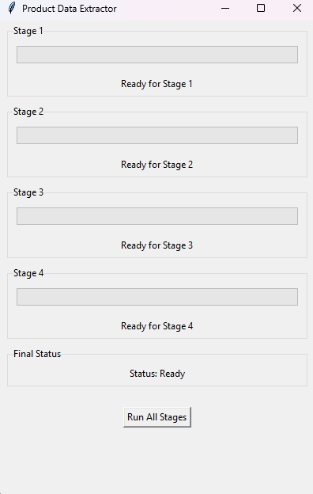

# Amazon Scraper

    

Bu uygulama, Amazon ürün verilerini HTML dosyalarından çıkararak JSON formatında kaydetmek için tasarlanmıştır. Kullanıcı dostu bir grafik arayüz (GUI) sunarak dört aşamada veri işleme sürecini yönetir.

## Gereksinimler

Uygulama, gerekli Python kütüphanelerini otomatik olarak yükleyecek şekilde derlenmiştir, bu nedenle kullanıcıların kütüphaneleri manuel olarak yüklemeleri gerekmez.

## Uygulamanın Çalıştırılması

1. **Uygulamayı İndirin**: Uygulamanın `.exe` dosyasını bilgisayarınıza indirin.

2. **Klasör Yapısını Kontrol Edin**:
   - Uygulama, çalışması için belirli klasörlerin var olmasını bekler. Aşağıdaki klasörlerin doğru bir şekilde oluşturulup oluşturulmadığını kontrol edin:
     - `htmlfiles`: HTML dosyalarının bulunduğu klasör.
     - `jsonfiles`: JSON çıktılarının kaydedileceği klasör.
     - `all_amazon_products_html`: Ürün detaylarının indirileceği klasör.
   - Gerekirse bu klasörleri manuel olarak oluşturun veya uygulama ilk çalıştığında otomatik olarak oluşturmasını bekleyin.

## Çalıştırma

3. **Uygulamayı Başlatın**:
   - `.exe` dosyasına çift tıklayarak uygulamayı başlatın.
   - Uygulama açıldığında, GUI (grafik kullanıcı arayüzü) ekranını göreceksiniz. Burada dört aşama göreceksiniz:
     - **Aşama 1**: Ürün verilerinin çıkarılması
     - **Aşama 2**: Ürün detaylarının indirilmesi
     - **Aşama 3**: Detaylı ürün bilgilerinin çıkarılması
     - **Aşama 4**: Veri birleştirme

4. **Veri İşlemi**:
   - Aşama 1 için gerekli HTML dosyalarını `htmlfiles` klasörüne yükleyin.
   - "Run All Stages" butonuna tıklayarak tüm aşamaları başlatın.
   - Her aşama tamamlandıkça ilerleme çubukları dolacak ve durum mesajları güncellenecektir.

5. **Sonuçları Kontrol Edin**:
   - Tüm aşamalar tamamlandığında, `jsonfiles` klasöründe aşağıdaki dosyaları bulabilirsiniz:
     - `amazon_products.json`: Aşama 1 çıkışı.
     - `extracted_product_data.json`: Aşama 3 çıkışı.
     - `merged_products.json`: Aşama 4 sonucu.
   - Bu dosyaları inceleyerek verilerin doğru bir şekilde işlendiğinden emin olabilirsiniz.

## Önemli Noktalar

- **Hata Yönetimi**: Uygulama, herhangi bir hata durumunda kullanıcıyı bilgilendirecek şekilde tasarlanmıştır. Eğer bir hata ile karşılaşırsanız, hata mesajını dikkatlice okuyun ve gerekli düzeltmeleri yapın.

- **Destek**: Uygulama ile ilgili daha fazla bilgi veya yardım isterseniz, projenin sahibi veya geliştirici ile iletişime geçmek faydalı olacaktır.

## Lisans

Bu proje [MIT Lisansı](LICENSE) altında lisanslanmıştır.
